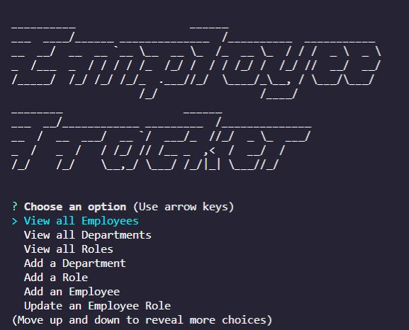
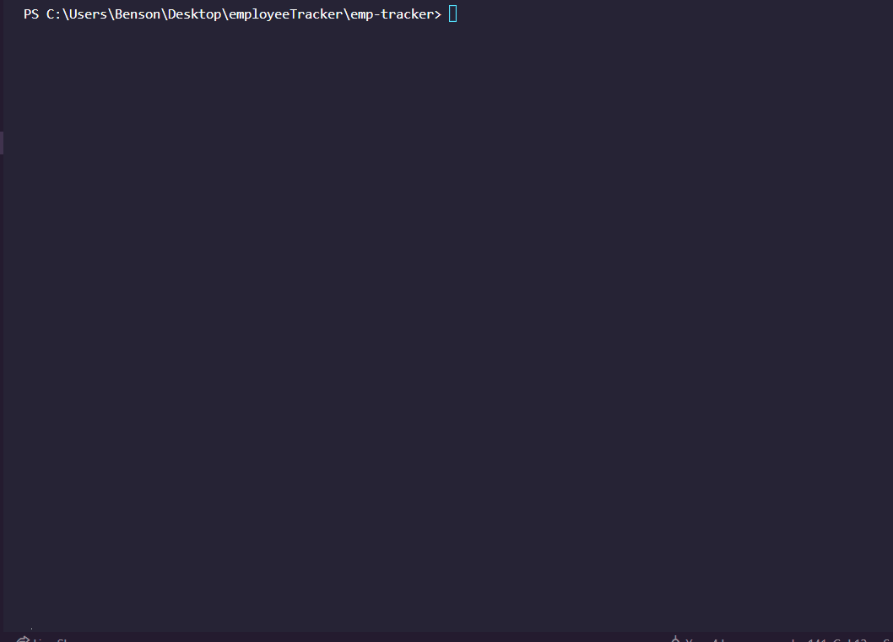

# Employee Tracker




<br>

## Table of Contents

- [Description](#description)
- [Installation](#installation)
- [Usage](#usage)
- [Demo](#demo)
- [Technologies Used](#technologies-used)
- [Questions](#questions)
- [License](#license)

<br>

## Description

A Command Line Interface(CLI) Application that allows a user to maintain an active employee database. Employees, roles and departments are able to be created, read, updated and deleted(CRUD) from the user's terminal.

<br>

## Installation

[Node.js](https://nodejs.org/en/) installation is required.

Run to install dependencies:

```
npm install
```

<br>

## Usage

Run the application by entering the following command line and answer the resulting questions-

```
node app.js
```

<br>

## Demo

<br>

[Full Video Demo](https://drive.google.com/file/d/1yIqOX--lV8A__oeqv3z-9nNMT06sUJdY/view)

<br>
Demo gif:



<br>

## Technologies Used

- [Node.js](https://nodejs.org/en/)
- [mysql2](https://www.npmjs.com/package/mysql2)
- [inquirer](https://www.npmjs.com/package/inquirer)
- [console.table](https://www.npmjs.com/package/console.table)
- [figlet](https://www.npmjs.com/package/figlet)

<br>

## Questions

Contact me here:

- [GitHub Profile](https://github.com/mbenson025)
- Email me at mbenson025@gmail.com

<br>

## License

MIT License

Copyright (c) 2022 Mason Benson

Licensed under the [MIT](LICENSE) license.
